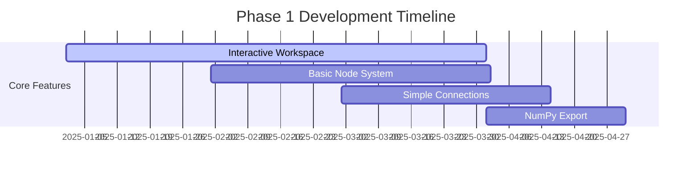

<div align="center">

# 🧠 Neural Network Designer ✨

### *Democratizing AI through Visual Design*

[](LICENSE)
[](https://reactjs.org/)
[](https://www.typescriptlang.org/)
[](https://vitejs.dev/)

[🚀 **Live Demo**](http://localhost:3000) • [📚 **Documentation**](./docs/) • [🐛 **Report Bug**](https://github.com/Lunarcolony/ailearning/issues) • [💡 **Request Feature**](https://github.com/Lunarcolony/ailearning/issues)

</div>

---

## 🎨 What is Neural Network Designer?

**Neural Network Designer** is a revolutionary visual platform that transforms complex neural network architecture into an intuitive **drag-and-drop experience**. Inspired by n8n's workflow automation, we're making machine learning accessible to everyone - from students taking their first AI course to researchers prototyping cutting-edge architectures.

> 💡 **"Design neural networks like building blocks, export production-ready code"**

<div align="center">

### 🌟 **Key Highlights**

| 🎯 **Visual Design** | 🔧 **Multi-Framework** | 📚 **Educational** | 🚀 **Production Ready** |
|:---:|:---:|:---:|:---:|
| Drag & drop interface | TensorFlow, PyTorch, NumPy | Interactive tutorials | Clean, exportable code |

</div>

## 🎯 Our Mission

<div align="center">
<h3>🌍 <strong>Democratize AI for Everyone</strong></h3>
<p><em>Bridging the gap between theoretical understanding and practical implementation</em></p>
</div>

We believe that **neural network design shouldn't require a PhD**. Our platform empowers educators, students, researchers, and professionals from all backgrounds to create, understand, and deploy machine learning models through visual design.

### 🔥 **Core Features**

<table>
<tr>
<td align="center" width="50%">

**🎨 Visual-First Design**
<br>
*Drag-and-drop neural network layers*
<br>
No more complex code syntax
<br>
Focus on architecture, not implementation

</td>
<td align="center" width="50%">

**🔧 Multi-Framework Export**
<br>
*TensorFlow • PyTorch • NumPy*
<br>
Production-ready code generation
<br>
Choose your preferred ML framework

</td>
</tr>
<tr>
<td align="center">

**📚 Educational Focus**
<br>
*Interactive learning experience*
<br>
Built-in tutorials and examples
<br>
Perfect for classrooms and self-study

</td>
<td align="center">

**🚀 Rapid Prototyping**
<br>
*Quick iteration and testing*
<br>
Real-time network validation
<br>
From concept to code in minutes

</td>
</tr>
</table>

## 📈 Development Progress

<div align="center">

### 🏗️ **Current Status: Foundation Complete** 


</div>

### ✅ **Completed Milestones**

<details open>
<summary><strong>🎉 Phase 1: Foundation (100% Complete)</strong></summary>
<br>

- ✅ **Modern React Architecture** - TypeScript, hooks, and functional components
- ✅ **Beautiful UI Framework** - Tailwind CSS with Framer Motion animations
- ✅ **Seamless Navigation** - Multi-page SPA with React Router
- ✅ **Robust State Management** - Redux Toolkit for complex interactions
- ✅ **Icon System** - Comprehensive Lucide React icon library
- ✅ **Development Environment** - Vite build system with HMR
- ✅ **Code Quality** - ESLint, Prettier, and TypeScript configurations

</details>

### 🚧 **In Active Development**

<details>
<summary><strong>⚡ Phase 2: Core Features (45% Complete)</strong></summary>
<br>

- 🔄 **Interactive Canvas** - Grid-based workspace for neural network design
- 🔄 **Node System** - Draggable neural network layer components  
- 🔄 **Connection Engine** - Visual data flow between network nodes
- ⏳ **Code Generator** - Multi-framework export functionality

</details>

### 📊 **Detailed Progress Tracking**

| Feature | Status | Progress | ETA |
|---------|:------:|:--------:|-----|
| 🎨 Frontend UI | ✅ |  | Complete |
| 🖼️ Canvas Workspace | 🚧 |  | Q1 2025 |
| 🔗 Node Management | 🚧 |  | Q1 2025 |
| ⚙️ Code Generation | ⏳ |  | Q2 2025 |
| 🔐 Authentication | ⏳ |  | Q2 2025 |
| 🌐 Backend API | ⏳ |  | Q2 2025 |

## 🗺️ Roadmap to the Future

<div align="center">

### 🚀 **Our Journey Ahead**

*From MVP to Industry Leader*

</div>

<details>
<summary><h3>🎯 <strong>Phase 1: MVP Foundation</strong> (6-12 months) 🏗️</h3></summary>

**Goal:** Deliver a working visual neural network designer



**Key Deliverables:**
- ✨ **Interactive Canvas** - Infinite grid workspace with pan/zoom
- 🧩 **Basic Nodes** - Input, Dense, Output layer components
- 🔗 **Connections** - Click-and-drag neural pathways
- 🐍 **NumPy Export** - Pure Python code generation
- 💾 **Project Saves** - Local storage for user designs
- 📖 **Tutorial System** - Step-by-step learning guides

</details>

<details>
<summary><h3>🎯 <strong>Phase 2: Enhanced Platform</strong> (1-2 years) ⚡</h3></summary>

**Goal:** Professional-grade features and framework support

**Advanced Capabilities:**
- 🧠 **CNN/RNN Nodes** - Convolutional and recurrent layers
- 🔧 **Multi-Framework** - TensorFlow, PyTorch exports
- ✅ **Real-time Validation** - Architecture error detection
- 📱 **Mobile Support** - Touch-optimized interface
- 👥 **Collaboration** - Multi-user editing
- 🎨 **3D Visualization** - Interactive network topology

</details>

<details>
<summary><h3>🎯 <strong>Phase 3: AI-Powered Design</strong> (2-3 years) 🤖</h3></summary>

**Goal:** Intelligent assistance and cloud integration

**Smart Features:**
- 🧙‍♂️ **AI Architect** - Intelligent network suggestions
- ☁️ **Cloud Training** - Direct model training integration
- 🏪 **Template Store** - Community-driven design library
- 📊 **Performance Analytics** - Architecture optimization insights
- 🔌 **Custom Nodes** - User-defined layer types
- 🚀 **Auto-Deployment** - One-click model deployment

</details>

<details>
<summary><h3>🎯 <strong>Phase 4: Enterprise Ecosystem</strong> (3-5 years) 🏢</h3></summary>

**Goal:** Industry-leading ML design platform

**Enterprise Ready:**
- 🏢 **Team Management** - Advanced collaboration tools
- 🔧 **Plugin Architecture** - Third-party integrations
- 🌍 **Global CDN** - Worldwide infrastructure
- 🎓 **Certification Program** - Official training courses
- 📈 **Enterprise Analytics** - Advanced metrics and reporting
- 🤝 **Industry Partnerships** - Integration with ML platforms

</details>

## 🚀 Get Started in 60 Seconds

<div align="center">

### ⚡ **Quick Setup Guide**

*From zero to neural networks in under a minute*

</div>

### 📋 **Prerequisites Checklist**

Before diving in, make sure you have these tools ready:

| Tool | Version | Download | Status |
|------|---------|----------|---------|
| 🟢 **Node.js** | 18.0+ | [nodejs.org](https://nodejs.org/) | Required |
| 📦 **npm/yarn** | Latest | Included with Node.js | Required |
| 🔧 **Git** | Latest | [git-scm.com](https://git-scm.com/) | Required |

### 🎯 **One-Command Setup**

<div align="center">

**Clone • Install • Run**

</div>

```bash
# 🚀 The Express Lane (copy & paste this!)
git clone https://github.com/Lunarcolony/ailearning.git && cd ailearning && npm install && npm run dev
```

### 📝 **Step-by-Step Setup**

<details>
<summary><strong>🔍 Prefer detailed steps? Click here!</strong></summary>
<br>

**1. 📥 Clone the Magic**
```bash
git clone https://github.com/Lunarcolony/ailearning.git
cd ailearning
```

**2. 📦 Install Dependencies**
```bash
# Using npm (recommended)
npm install

# Or using yarn
yarn install
```

**3. 🔥 Fire it Up**
```bash
# Start development server
npm run dev

# Or with yarn  
yarn dev
```

**4. 🌐 Open & Explore**
```bash
# Automatically opens http://localhost:3000
# Start designing your first neural network!
```

</details>

<div align="center">

### 🎉 **Success!** 
*Your development server is now running at* **http://localhost:3000** 


</div>

### Available Scripts

- **`npm run dev`** - Start development server with hot reload
- **`npm run build`** - Build the application for production
- **`npm run preview`** - Preview the production build locally
- **`npm test`** - Run tests (when test suite is implemented)

### Development Workflow

1. **Create a new branch** for your feature
   ```bash
   git checkout -b feature/your-feature-name
   ```

2. **Make your changes** and test them locally

3. **Build and test**
   ```bash
   npm run build
   ```

4. **Commit your changes**
   ```bash
   git add .
   git commit -m "Add your feature description"
   ```

5. **Push and create a pull request**
   ```bash
   git push origin feature/your-feature-name
   ```

## 🛠️ Cutting-Edge Tech Stack

<div align="center">

### 🏗️ **Built with Modern Excellence**

*Every technology chosen for performance, developer experience, and scalability*

</div>

<table>
<tr>
<td align="center"><h3>🎨 <strong>Frontend Powerhouse</strong></h3></td>
<td align="center"><h3>⚙️ <strong>Development Arsenal</strong></h3></td>
</tr>
<tr>
<td valign="top" width="50%">

| Technology | Version | Purpose |
|------------|---------|---------|
|  | **19.1+** | Modern UI Library |
|  | **5.9+** | Type Safety |
|  | **7.1+** | Lightning Build |
|  | **3.4+** | Styling System |
|  | **12.23+** | Smooth Animations |

</td>
<td valign="top" width="50%">

| Tool | Version | Purpose |
|------|---------|---------|
|  | **8.5+** | CSS Processing |
|  | **Latest** | Code Linting |
|  | **Latest** | Code Formatting |
|  | **2.9+** | State Management |
|  | **7.9+** | Client Navigation |

</td>
</tr>
</table>

<details>
<summary><h3>🔮 <strong>Future Backend Stack</strong> (Coming Soon)</h3></summary>
<br>

<div align="center">

**🐍 Python-Powered Backend Architecture**

</div>

| Layer | Technology | Purpose | Status |
|-------|------------|---------|---------|
| **🌐 API** |  | High-performance API | 📅 Planned |
| **💾 Database** |  | Project Storage | 📅 Planned |
| **⚡ Cache** |  | Session Management | 📅 Planned |
| **🔄 Tasks** |  | Background Processing | 📅 Planned |

</details>

<details>
<summary><h3>🤖 <strong>ML Framework Support</strong></h3></summary>
<br>

<div align="center">

**🧠 Multi-Framework Code Generation**

</div>

| Framework | Logo | Use Case | Export Status |
|-----------|------|----------|---------------|
| **NumPy** |  | Pure Python Implementation | 🔄 In Progress |
| **TensorFlow** |  | Production ML Models | 📅 Planned |
| **PyTorch** |  | Research & Development | 📅 Planned |

</details>

## 📁 Project Structure

```
ailearning/
├── src/
│   ├── components/           # Reusable UI components
│   ├── pages/               # Main application pages
│   ├── store/               # Redux store and slices
│   ├── hooks/               # Custom React hooks
│   ├── utils/               # Utility functions
│   ├── App.tsx              # Main application component
│   └── main.tsx             # Application entry point
├── public/                  # Static assets
├── dist/                    # Production build output
├── docs/                    # Project documentation
│   ├── project_overview.md  # Detailed project overview
│   └── website_structure.md # Technical architecture
├── package.json             # Dependencies and scripts
├── vite.config.ts           # Vite configuration
├── tailwind.config.js       # Tailwind CSS configuration
├── tsconfig.json            # TypeScript configuration
└── README.md                # This file
```

## 🤝 Join Our Community

<div align="center">

### 💫 **Every Contribution Matters**

*From bug reports to breakthrough features - your input shapes the future of AI accessibility*


</div>

### 🌟 **Ways to Make an Impact**

<table>
<tr>
<td align="center" width="33%">

**🐛 Bug Hunter**
<br><br>
Found something broken?
<br>
Help us squash bugs and improve stability
<br><br>
[](https://github.com/Lunarcolony/ailearning/issues/new?template=bug_report.md)

</td>
<td align="center" width="33%">

**💡 Visionary**
<br><br>
Have a brilliant idea?
<br>
Share feature requests and suggestions
<br><br>
[](https://github.com/Lunarcolony/ailearning/issues/new?template=feature_request.md)

</td>
<td align="center" width="33%">

**⚡ Code Warrior**
<br><br>
Ready to code?
<br>
Submit pull requests and enhancements
<br><br>
[](https://github.com/Lunarcolony/ailearning/pulls)

</td>
</tr>
</table>

### 🚀 **Quick Start for Contributors**

<details>
<summary><strong>📚 First Time Contributing? Start Here!</strong></summary>
<br>

**Step 1:** 📖 **Understand the Vision**
- Read our [Project Overview](project_overview.md)
- Browse the [Architecture Guide](docs/website_structure.md)
- Check out [Good First Issues](https://github.com/Lunarcolony/ailearning/labels/good%20first%20issue)

**Step 2:** 🛠️ **Set Up Your Environment**
- Fork the repository
- Follow our [development setup guide](#-get-started-in-60-seconds)
- Join our [Discord community](https://discord.gg/ailearning) *(coming soon)*

**Step 3:** 🎯 **Pick Your Battle**
- Browse [open issues](https://github.com/Lunarcolony/ailearning/issues)
- Comment to claim an issue
- Create a feature branch: `git checkout -b feature/amazing-feature`

**Step 4:** ✨ **Create Magic**
- Write clean, well-documented code
- Follow our style guidelines
- Test thoroughly
- Submit a PR with a clear description

</details>

### 📜 **Contribution Guidelines**

<div align="center">

**🎨 Code Style** • **📝 Clear Commits** • **🧪 Test Everything** • **📖 Document Changes**

</div>

| Area | Guidelines | Tools |
|------|------------|-------|
| **💻 Code Quality** | TypeScript best practices, consistent formatting | ESLint, Prettier |
| **📝 Commit Style** | Clear, descriptive messages following conventional commits | Conventional Commits |
| **🧪 Testing** | Thorough testing before submission | `npm run build` |
| **📖 Documentation** | Update docs for new features | Markdown, JSDoc |

<div align="center">

### 🏆 **Recognition Wall**

*We celebrate every contributor who helps democratize AI!*

<!-- Contributors will be automatically added here -->
[](https://github.com/Lunarcolony/ailearning/graphs/contributors)

</div>

## 📄 License

This project is licensed under the ISC License - see the [LICENSE](LICENSE) file for details.

<div align="center">

## 🌟 Show Your Support

### **Help us democratize AI for everyone!**

*Every star ⭐, share 📢, and contribution 🤝 helps us reach more developers, educators, and students worldwide*

<table>
<tr>
<td align="center" width="25%">

**⭐ Star Us**
<br>
Show your appreciation
<br>
[](https://github.com/Lunarcolony/ailearning/stargazers)

</td>
<td align="center" width="25%">

**🔄 Share**
<br>
Spread the word
<br>
[](https://twitter.com/intent/tweet?text=Check%20out%20this%20amazing%20visual%20neural%20network%20designer!&url=https://github.com/Lunarcolony/ailearning)

</td>
<td align="center" width="25%">

**🐛 Report Issues**
<br>
Help us improve
<br>
[](https://github.com/Lunarcolony/ailearning/issues)

</td>
<td align="center" width="25%">

**💬 Discuss**
<br>
Join conversations
<br>
[](https://github.com/Lunarcolony/ailearning/discussions)

</td>
</tr>
</table>

---

## 📞 Connect With Us

<div align="center">

### 🌍 **Join the Neural Network Revolution**

| Platform | Purpose | Link |
|----------|---------|------|
| 🐙 **GitHub Issues** | Bug reports & feature requests | [](https://github.com/Lunarcolony/ailearning/issues) |
| 💬 **Discussions** | Community Q&A and ideas | [](https://github.com/Lunarcolony/ailearning/discussions) |
| 📖 **Documentation** | Guides and tutorials | [](./docs/) |
| 🚀 **Live Demo** | Try it yourself | [](http://localhost:3000) |

</div>

---

<div align="center">

## 💝 **Built with ❤️ for the AI Community**

### *"Making neural network design accessible to everyone, one visual node at a time"*

<br>


<br>

**🙏 Thank you for being part of our mission to democratize artificial intelligence!**

<sub>© 2025 Neural Network Designer • Licensed under ISC • Made with passion by the community</sub>

</div>