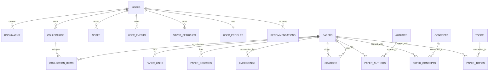

# Database Schema and ERD

## Core entities
See `backend/app/models/entities.py` for full SQLAlchemy definitions.

## ERD (logical)

```mermaid
erDiagram
    USERS ||--o{ BOOKMARKS : creates
    USERS ||--o{ COLLECTIONS : owns
    USERS ||--o{ NOTES : writes
    USERS ||--o{ USER_EVENTS : emits
    USERS ||--o{ SAVED_SEARCHES : saves
    USERS ||--|| USER_PROFILES : has
    USERS ||--o{ RECOMMENDATIONS : receives

    PAPERS ||--o{ PAPER_LINKS : has
    PAPERS ||--o{ PAPER_SOURCES : has
    PAPERS ||--o{ EMBEDDINGS : represented_by
    PAPERS ||--o{ CITATIONS : citing
    PAPERS ||--o{ CITATIONS : cited

    PAPERS ||--o{ PAPER_AUTHORS : has
    AUTHORS ||--o{ PAPER_AUTHORS : appears_in

    PAPERS ||--o{ PAPER_CONCEPTS : tagged_with
    CONCEPTS ||--o{ PAPER_CONCEPTS : connected_to

    PAPERS ||--o{ PAPER_TOPICS : tagged_with
    TOPICS ||--o{ PAPER_TOPICS : connected_to

    COLLECTIONS ||--o{ COLLECTION_ITEMS : includes
    PAPERS ||--o{ COLLECTION_ITEMS : in_collection
```
